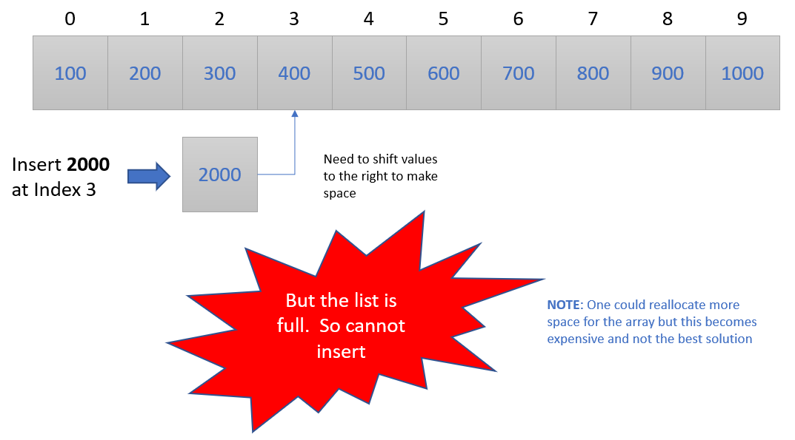

# Array List Data Structure

The contents within this directory are implementations of the array list data structure.  This data structure
uses the languages built in array functionality to build the data structure.  Each language will build the
data structure for three data types.
1. Integer
2. Double (Floating Point) 
3. String

For languages that support dynamic typing (i.e. Python, Ruby, etc.) these three types can easily coexist
in a single implementation.  For non-dynamic languages (i.e. C, Go, etc.) three seperate implementations
exist for the three types.  C++ implementation uses templates and lets the precompiler take care of the
three type builds while Java uses generic Objects to implement the data structure.  

## Implementation

At the core an array list data structure uses an array to store and manage data.  Essentially it is more
advanced wrapper around a normal array.  This data structure will manage the insertion and deletion of 
data while ensuring that data is shifted appropriately to keep it sequential.  

The figure below shows an example of the array list data structure.

This implementation requires the initial size of the array list when initiated.  Once the list is full
it will not allow any more additions until space is cleared.  In theory one could make more space in 
the array by reallocating the array size but this is generally frowned upon since this can be an 
expensive operation.  This is one of the major pitfalls of this data structure but if your list size is
known and not expected to change this data structure is one of the easiest to implement.

Data is inserted into the array list by either specifying the index or putting it at the end.  The data
structure keeps track of the state of the data and knows when insertion is done correctly.  If done
incorrectly then the user is made aware via an error message.

The figure below shows the insertion process for an array list.

