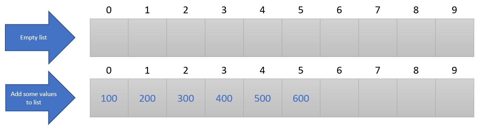
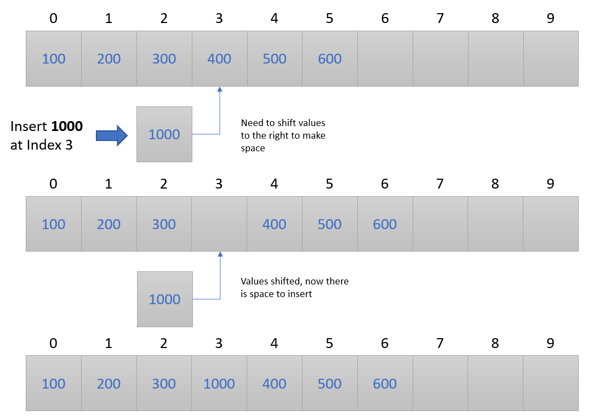

# Array List Data Structure

The contents within this directory are implementations of the array list data structure.  This data structure
uses the languages built in array functionality to build the data structure.  Each language will build the
data structure for three data types.
1. Integer
2. Double (Floating Point) 
3. String

For languages that support dynamic typing (i.e. Python, Ruby, etc.) these three types can easily coexist
in a single implementation.  For non-dynamic languages (i.e. C, Go, etc.) three seperate implementations
exist for the three types.  C++ implementation uses templates and lets the precompiler take care of the
three type builds while Java uses generic Objects to implement the data structure.  

## Implementation

At the core an array list data structure uses an array to store and manage data.  Essentially it is more
advanced wrapper around a normal array.  This data structure will manage the insertion and deletion of 
data while ensuring that data is shifted appropriately to keep it sequential.  

The figure below shows an example of the array list data structure.

The array list data structure is one of the easiest due to the implicit behavior of the array.  The 
data structure implementation is really nothing more than a more advanced wrapper built around it to
create an easy user interface to managing the data.  While this is one of the more simpler data 
structures it does have some pitfalls which do not make it ideal for most applications.  This includes
1. Array size must be initialized up front.  Most situations do not always know how much data will be stored.
2. Unknown size give two options.  Initialize a very large array (wastes resources) or reallocate the
array size (expensive operation).
3. Should you want to create a list of multiple data types, this can be difficult or impossible in some langauges

This implementation requires the initial size of the array list when initiated.  Once the list is full
it will not allow any more additions until space is cleared.  

### Inserting Item

Data is inserted into the array list by either specifying the index or putting it at the end.  The data
structure keeps track of the state of the data and knows when insertion is done correctly.  If done
incorrectly then the user is made aware via an error message.

If inserting an item in the middle of the list then the program will first shift the contents of the 
list over starting from the insertion index and then place the new value in the specified index.

The figure below shows the insertion process for an array list which is not full.

The figure below shows the insertion process for an array list which **IS** full.  Note that this operation
will not succeed in this implementation.

### Deleting Item

Data is deleted from the array list by deleting a specific index or by deleting the item by its value.  In
both cases the validity of the call is checked and errors are issued if they occur.

The figure below shows the deletion process.

