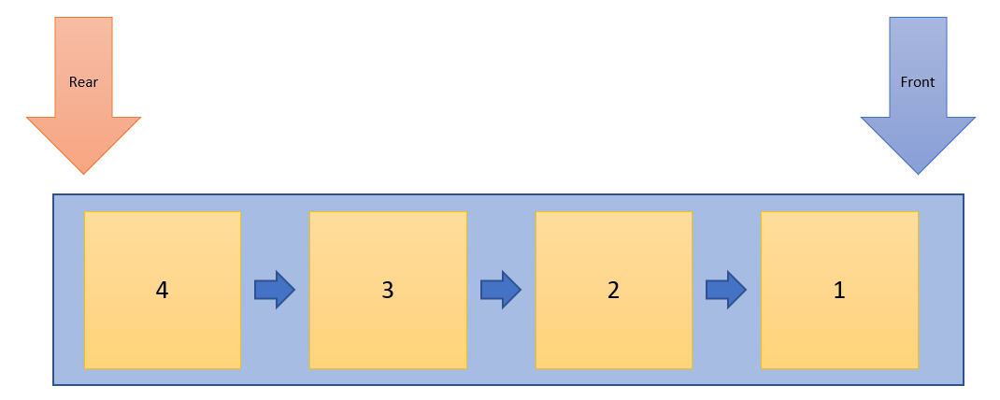

# QUEUES

Queues are more a less a list with some very specific rules.  A queue works on the 
First-In-First-Out (FIFO) principle.  An item is initially pushed into the queue called **enqueue**. 
When the next item is enqueued it will be placed behind the previously enqueued item.  This behaves
exactly like a line of people waiting for an event.  The person at the front of the line gets into 
the event first followed by the person behind them and so on.

The queue can be implemented with either a linked list or an array list each of which offer their
own pros and cons.

The figure below shows a simple data structure representation of a queue.

## Enqueue

This is the process of adding an item to the queue.  When the item is added it will be placed behind 
the previously added item.  For example we have four items that we wish to enqueue.'
1. Item 1
2. Item 2
3. Item 3
4. Item 4

Enqueuing Item 1 will place it at the front of the queue.  Item 2 will be enqueued next and placed behind
Item 1.  Item 3 will be enqueued next and go behind Item 2.  Finally, Item 4 will be equeued next being
placed behind Item 3.  The figures below show this process.

## Dequeue

We can remove items just as easily as we add them using the dequeue operation.  When an item is dequeued
it is taken from the front of the queue and all the remaining items are shifted so the item behind the
recently removed item is next to be dequeued.  This process continues so long as the queue is not empty.
Obviously, once empty nothing further can be dequeued.  The following figures show the dequeue operation.

