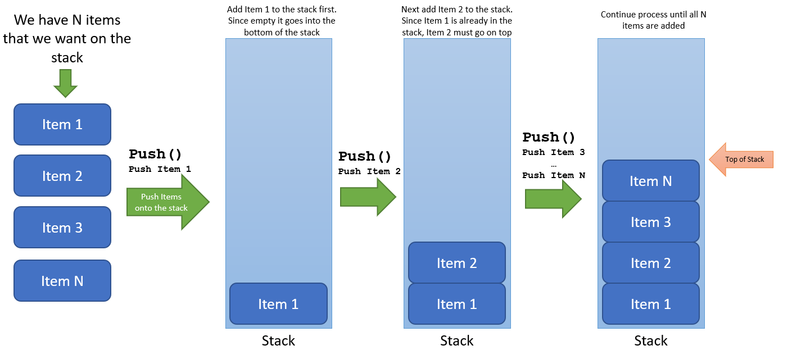
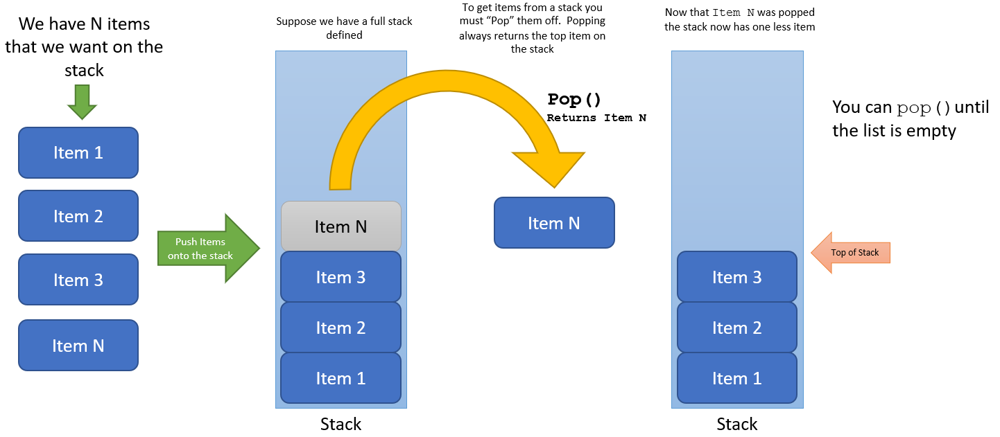

# Stacks

Stacks are more a less a list with some very specific rules.  A stack works on the 
First-In-First-Out (FIFO) principle.  As with most things in computing, there is 
more than one way to implement things.  The issue becomes for which situation is one
way better than the other.

The basic function of stack operates around the **push** and **pop** concept.  

## Push

Keeping with the FIFO principle, when something is pushed it is placed on top of the 
stack.  If items pushed onto the stack exceed the stack length then this is known as 
a stack overflow which can be quite bad since other memory locations can be corrupted
that are outside of the stack itself.

The figure below shows the basic operation of pushing to the stack

## Pop

Getting items from the stack is called **pop**.  Again, this follows the FIFO principle
which means that when pop is called, the item on top of the stack is returned. You can
continue to pop items from the stack so long as the stack is not empty.

The figure below shows the basic operation of popping from the stack

## Implementation

The stack concept can be easily implemented with an Array List or a Linked List.  Using 
the Array List will require that you set a fixed stack height.  This could possible 
result in a stack overflow but this implementation will prevent that.  Linked List
does not require a fixed size and will continue to add to the stack until memory is 
exhausted. 
