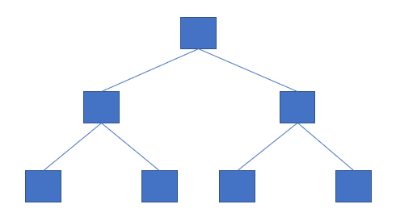
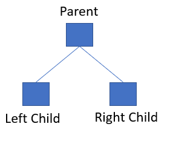
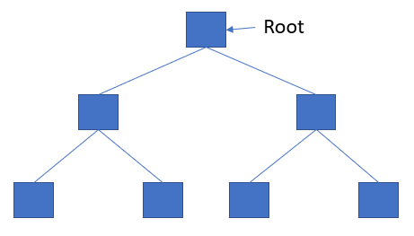
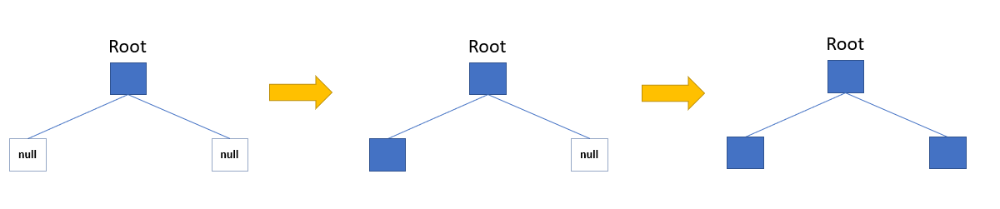
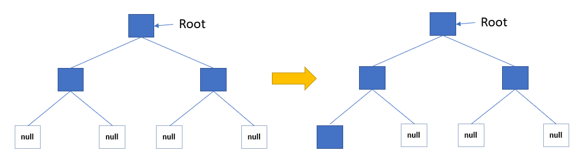
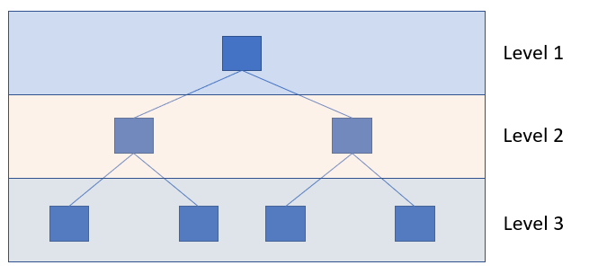
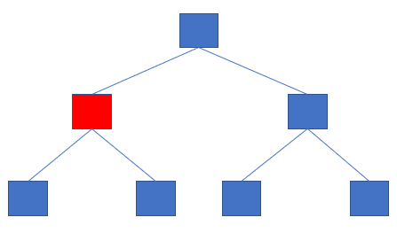
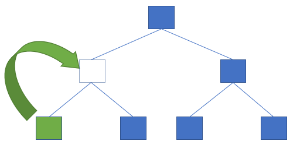
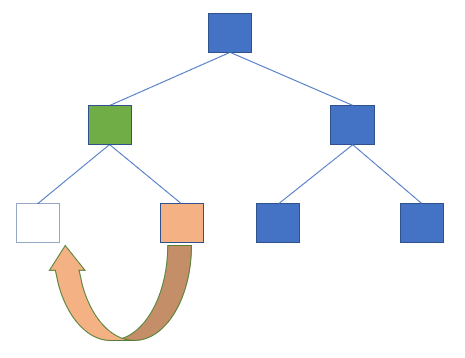
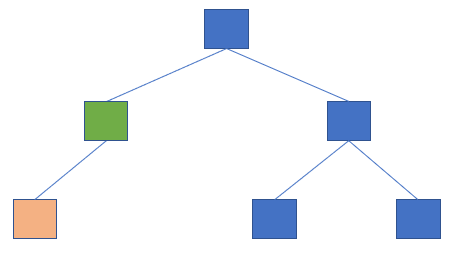

# Generic Binary Tree Data Structure

A binary tree data structure is modeled so that each node has at most two children referred to as the 
left and right child.

The contents within this directory are implementations of the binary tree data structure.  Each language 
will build the data structure for three data types.
1. Integer
2. Double (Floating Point) 
3. String

For languages that support dynamic typing (i.e. Python, Ruby, etc.) these three types can easily coexist
in a single implementation.  For non-dynamic languages (i.e. C, Go, etc.) three seperate implementations
exist for the three types.  C++ implementation uses templates and lets the precompiler take care of the
three type builds while Java uses generic Objects to implement the data structure.  

## Implementation

A generic binary tree is a general type of binary tree where the tree nodes are not strictly organized.  
Usually developers use a specific type of binary tree (Binary Search Tree, AVL Tree, etc.) which are more 
optimized utilizations of the binary tree structure.  

A generic binary tree is shown in the figure below.

A binary tree consists of nodes which link together through the parent-child concept.  You will see that
each node will have at most two children.  The next figure shows a parent node with its children nodes.

At the top of every tree there is a single node which is called the **Root** node.  It is the only node
whose parent is NULL.

The binary tree is connected by using links/pointers to the nodes they are connected.  The real work, 
with a binary tree, is manipulating the data stored within it.

### Inserting

Since this a generic binary tree there is no set defined way of inserting items into the tree.  The only
rule is that there can be at most two children per node.  However, for sake of making something I
established a rule set.

As the above figure shows, initially the tree is empty.  So upon adding the first element it will become the 
ROOT and the rest of the tree will grow from there.  You will notice that it points to two children called *null*.
These aren't actually real children but instead a way to show that these spots are open.  All tree nodes by 
default point to NULL. 

Suppose we insert another node.  The insertion will look to see what spots are available on the left child.  It 
determines the left child is open and inserts it there.  A third value is then inserted.  The insertion algorithm
will look for an open left child but will not find one.  It then looks for a right child which it will find.

If another item is added then the tree will have to grow to accommodate which is shown in the above picture.  The
insertion will fill the next available spot from the left.  This process will continue until the tree nodes ceased 
to be added.

This brings up another term called *levels*.  As the tree grows and shrinks the level of the tree will change with
it.  The level of the tree is useful in understanding the size of the tree.  You will see, in the figure below, the
levels of the tree.  The ROOT is always the first level and below it is the second, and so on.  The depth of the tree
is the maximum number of levels.

### Deleting

Deleting a tree node presents a new set of issues that have to be handled.  For one when a tree node is removed its
children must be attended to or there will be a memory leak. 

The below figure shows the item which is to be deleted.  

As you can see, by deleting that node it has two children under it.  In order to keep those children in the tree, the
tree itself must be rearranged.  Again, in keeping with the left-child-filled precedent, the rearranging will operate
similiar to the insertion.

The deletion algorithm will look for the left child of the deleted node.  If it exists it will move it up to the spot
its old parent used to be.  Otherwise, the right child will be moved up.  If the node has neither a left or right 
child then the algorithm is done.

Once the node is moved up the algorithm then adheres to the left child policy.  Since the left child is now open it
will shift the right child to the left child as shown below.

When the rearranging satisfies the left child precedent then the deletion is complete.

